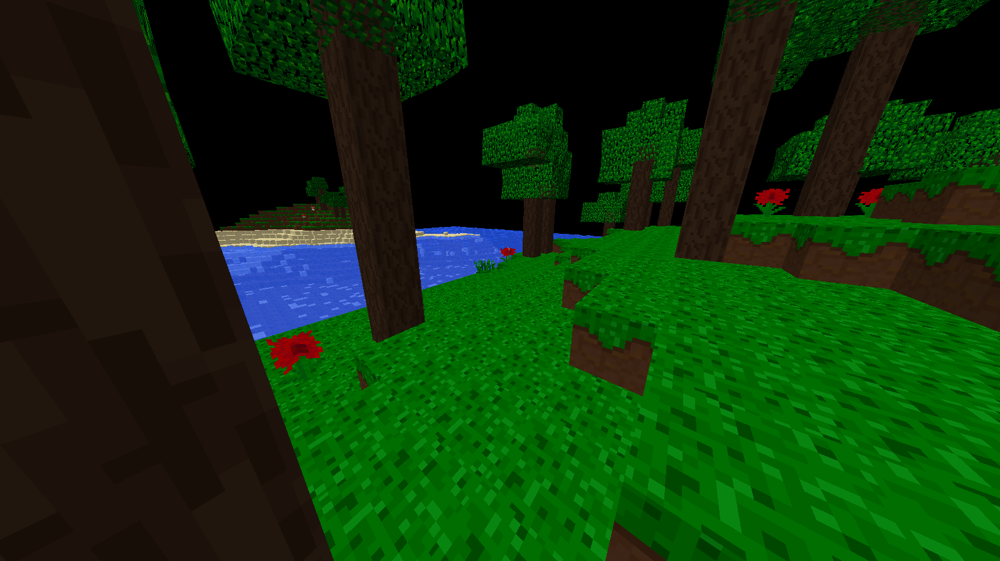
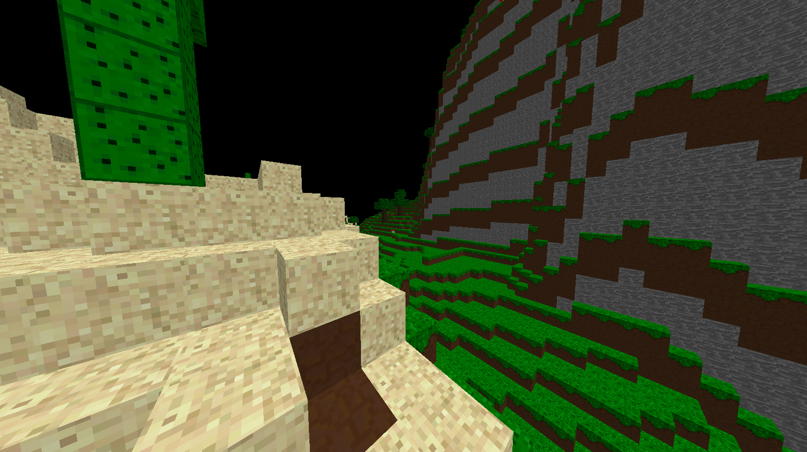
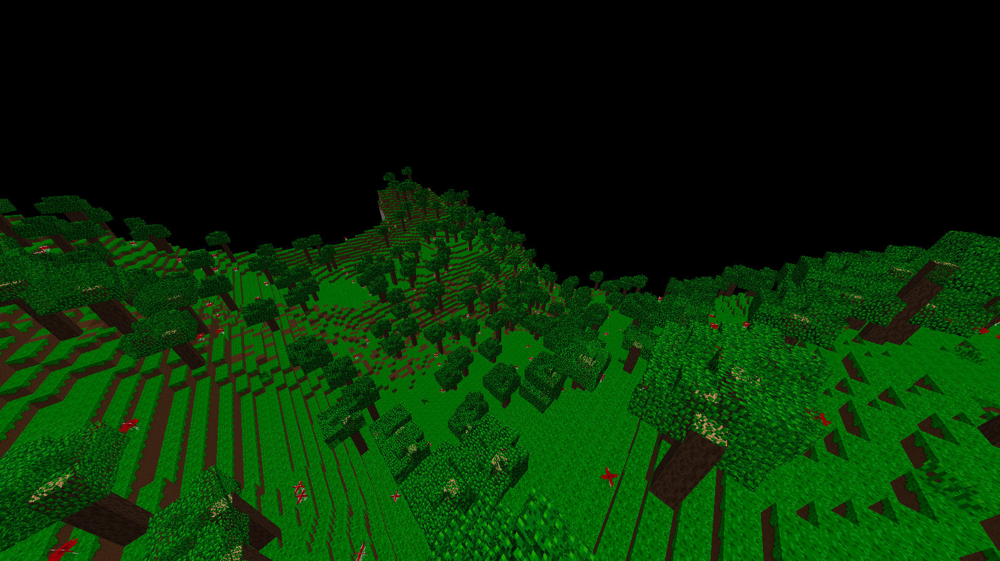

# minecraft-rust

Rust rewrite of the game Minecraft as a computer graphics practice for me.
With main reference thanks to [MineCraft-One-Week-Challenge](https://github.com/Hopson97/MineCraft-One-Week-Challenge).

# Gallery

# Building instructions

Just execute `cargo run` as common Rust projects do.

Specifically, because this project depends on `sfml` crate, you may need to read its
[instructions](https://crates.io/crates/sfml) about how to build this crate.

# License

This project is licensed under [Apache-2.0](https://spdx.org/licenses/Apache-2.0.html) license.
Read [LICENSE.txt](LICENSE.txt) for details.
